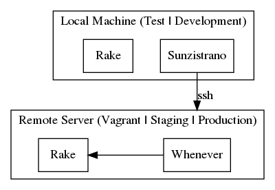
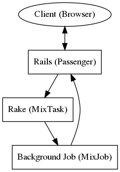
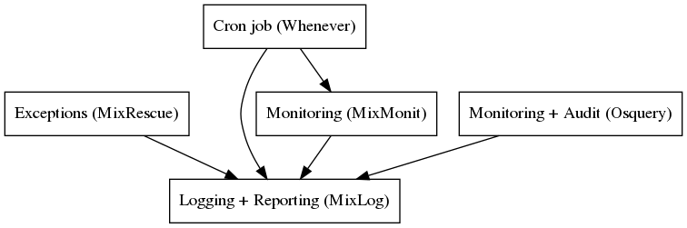
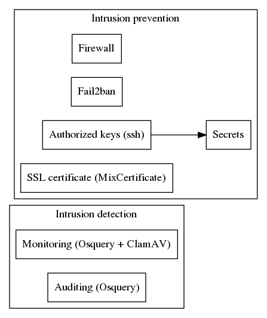

# WebTools

## Administration tools



### Standard environments

- test
  - local machine
  - as close as possible to the development context
- development
  - local machine
- vagrant
  - remote server (on local machine)
  - as close as possible to the staging context
- staging
  - remote server
  - as close as possible to the production context
- production
  - remote server

### Vagrant

[Vagrant](https://www.vagrantup.com/docs/index) is used as a development tool mirroring the actual client facing servers with the same operating system, libraries, etc.

See [Vagrantfile](./Vagrantfile) for a configuration example.

### Sunzistrano

Sunzistrano is used for multi-server provisioning which could be considered as the static part of an application: adding system libraries, modifying the operating system configurations, adding some swap, installing Ruby, etc.

Running the following command:

```sh
sun provision vagrant
```

with the current **system** role would execute the **recipes** and output the following in the manifest log:

```sh
# /home/vagrant/sun_manifest.log

Done [bootstrap/upgrade]
Done [bootstrap/time_locale]
Done [bootstrap/files]
Done [bootstrap/swap-0]
Done [bootstrap/limits]
Done [bootstrap/packages]
Done [bootstrap/ssh]
Done [bootstrap/firewall]
Done [bootstrap/firewall/deny_mail]
Done [bootstrap/fail2ban]
Done [bootstrap/private_ip]
Done [bootstrap/osquery]
Done [bootstrap/clamav]
Done [user/deployer]
Done [db/postgres-13]
Done [nginx/passenger]
Done [nginx/htpasswd]
Done [ssl/ca]
Done [ssl/self_signed]
Done [ssl/dhparam]
Done [lang/ruby/system]
Done [lang/nodejs/system]
Done [lang/python/system]
Done [db/postgres-13/tune]
Done [db/postgres-13/config]
Done [utils/packages]
Done [utils/htop]
Done [utils/parallel]
Done [lang/ruby/app-2.7.6]
Done [reboot]
```

### Capistrano

Capistrano is used for multi-application deployment and administration.

After the servers have been provisioned by Sunzistrano, the first deployment must go through more steps to configure or add some system pieces that weren't managed through Sunzistrano.

Running the following command:

```sh
cap vagrant provision
```

would do just that and have the following output without the details:

```sh
00:00 osquery:push
00:10 osquery:config_check
00:10 osquery:restart
00:13 nginx:push
00:15 nginx:config_check
00:15 deploy:check:directories
00:15 deploy:check:linked_dirs
00:15 deploy:check:make_linked_dirs
00:15 deploy:logrotate:push
00:17 secrets:push
00:17 nginx:app:push
00:19 nginx:maintenance:push
00:21 db:pg:set_superuser
00:21 whenever:create_cron_log
00:21 dns:set_hosts
00:22 git:wrapper
00:23 git:check
00:24 git:clone
00:25 git:update
00:27 git:create_release
00:27 whenever:push_every_minute
00:29 deploy:set_current_revision
00:29 deploy:symlink:linked_files
00:30 deploy:symlink:linked_dirs
00:36 bundler:config
00:38 bundler:install
00:38 deploy:migrate
00:39 deploy:migrating
00:41 whenever:update_crontab
00:42 deploy:symlink:release
00:43 passenger:restart
00:44 deploy:cleanup
00:45 deploy:log_revision
00:45 job:push
00:49 job:restart
00:49 deploy:assets:precompile
00:54 deploy:assets:backup_manifest
```

After that first deployment, only the following command is necessary for updating the application:

```sh
cap vagrant deploy
```

The list of administrative tasks is available through the following command:

```sh
cap -T
```

### Rake

Rake is used for application and system administration through the local CLI commands.

For example, the following command would migrate the database:

```sh
rake db:migrate
```

It could be used conjointly with Capistrano:

```sh
cap vagrant rake TASK=db:migrate
```

There is also a nohup version for scenarios where the task might take too long to execute:

```sh
cap vagrant nohup:rake TASK=db:migrate
```

The list of administrative tasks is available through the following command:

```sh
rake -T
```

### Whenever

Whenever is used for deploying cron jobs in order to automate regular administrive tasks.

It could be used conjointly with Rake. A standard task is `cron:everyday` which runs the following subtasks by default:

```ruby
'monit:cleanup'
'certificate:lets_encrypt:create_or_renew'
'flash:cleanup'
'geo:import_ips'
'global:cleanup'
'list:reorganize'
'clamav:scan'
'log:cleanup'
'log:extract'
'log:rollup'
'log:report' # will report by email to the sysadmin any event of interest
'db:pg:dump:rotate' # if flag_on? args, :dump
````

See [schedule.rb](./config/schedule.rb) for an example of use.

## Client facing task execution tools



### Passenger (with Nginx)

[Passenger](https://www.phusionpassenger.com/docs/tutorials/what_is_passenger/) is the web server used to run the Rails applications and is integrated with Nginx.

### MixJob (ActiveJob)

MixJob is a background processing utility and is integrated with Passenger and Rails.

### MixTask (Rake)

MixTask is a client facing interface for running Rake tasks in the background and is integrated with MixJob.

## Logging and monitoring tools



### MixLog

MixLog is a multi-server centralized logging utility with the available following entries:

- Cron jobs from syslog logs;
- Nginx access logs;
- Nginx error logs;
- ssh connections from auth logs;
- Blocked ssh connections from fail2ban logs;
- Postgresql logs;
- apt commands from history logs;
- Osquery monitoring and logs;
- Email events;
- Background job utility actions;
- Database monitoring;
- Host monitoring;
- Exceptions;
- Passenger worker events;
- ClamAV alerts;
- Rake task states;

It also includes a reporting utility usually executed daily through a cron job meant to flag any event of interest that a sysadmin should be made aware of.

### MixRescue

MixRescue is an exception handling utility currently integrated in the following contexts:

- Javascript client;
- Rails server requests;
- Rack server requests;
- RPC endpoint;
- Background jobs;
- Rake tasks;
- Monitoring captures;

### MixMonit

MixMonit is a monitoring utility meant to capture a snapshot of the system resources and is executed by a cron job through [Rails Runner](https://guides.rubyonrails.org/command_line.html#bin-rails-runner).

See [database.rb](./mix_monit/app/models/monit/postgres/database.rb) for more details about the database snapshot.

See [host.rb](./mix_monit/app/models/monit/linux/host.rb) for more details about the host snapshot.

### Osquery

[Osquery](https://osquery.io/) is a monitoring and auditing utility integrated with MixLog.

See [osquery.conf](./mix_server/config/deploy/templates/osquery/osquery.conf.erb) for more details about the monitoring and auditing queries and the watched files.

See [osquery.rb](./mix_log/app/models/log_lines/osquery.rb) for more details about the logged events in MixLog.

## System security tools



### Intrusion prevention

#### Firewall

UFW is used as the firewall and is setuped by default to allow only SSH, HTTP and HTTPS incoming.

#### Fail2ban

Fail2ban is used for preventing brute-force attacks of SSH accesses. It could be considered as an additional security measure for when SSH password access is allowed.

#### Authorized keys

The system has 2 main users with SSH access by key only (the password acces is deactivated by default):

- the **owner** (which is usually named 'ubuntu' from an Ubuntu VM provider) is used by Sunzistrano to provision the system;
- the **deployer** is used by Capistrano to deploy the application(s) and administrate the servers;

The owner's ssh key must be made available through the secrets of `config/settings.yml` as `:owner_public_key` and `:owner_private_key` and is available only to users with **secrets** access.

The deployer(s) public ssh key(s) must be made available through `config/settings.yml` as `:authorized_keys` and is used for giving SSH access to the servers.

#### Secrets

The system **secrets** are kept through the following mechanism:

- the `config/secrets.yml` which includes the secret `:secret_key_base`;
- the `config/settings.yml` which includes the `:authorized_keys` and uses the `:secret_key_base` value for encrypting other secret values;
- the `config/secrets.yml.age` which is the encrypted `config/secrets.yml` file and uses the `:authorized_keys` to give access to itself;

Essentially, if a user has been given access to the application git repository and has its SSH key added to the `:authorized_keys`, then full **secrets** access is available by decrypting `config/secrets.yml.age` with the corresponding private key.

See [secrets.rake](./mix_server/lib/tasks/mix_server/secrets.rake) and [mix_setting.rake](./mix_setting/lib/tasks/mix_setting.rake) for more details about the Rake tasks.

#### MixCertificate

MixCertificate is a SSL certificate utility based on [Let's Encrypt](https://letsencrypt.org/) and is used to automate the creation or renewal of certificates. It has a Rake task that is usually executed daily through a cron job.

See [mix_certificate.rake](./mix_certificate/lib/tasks/mix_certificate.rake) for more defails.

### Intrusion detection

#### Monitoring

The monitoring of unexpected files modifications, malicious files and sockets accesses is being done by Osquery and ClamAV.

ClamAV is an antivirus software and is usually executed daily through a cron job.

See [configuration.rb](./mix_server/lib/mix_server/configuration.rb) for more details about ClamAV default scanned directories.

#### Auditing

The auditing logs are created through Osquery by logging the system snapshots and the watched file and socket events.
